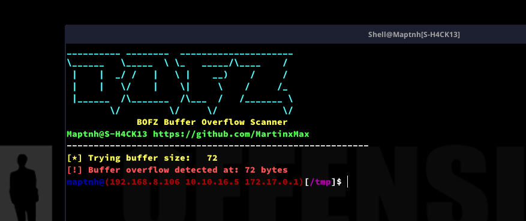

# BOFZ

BOFZ is a simple Buffer Overflow Scanner designed to detect buffer overflow vulnerabilities in a given executable.This tool is useful for quickly testing applications or binaries for common security flaws, particularly those that arise from improper bounds checking when handling user input.

# Usage

`$ ./bofz.sh <bin_file>`

`$ ./bofz.sh ./example`

 
